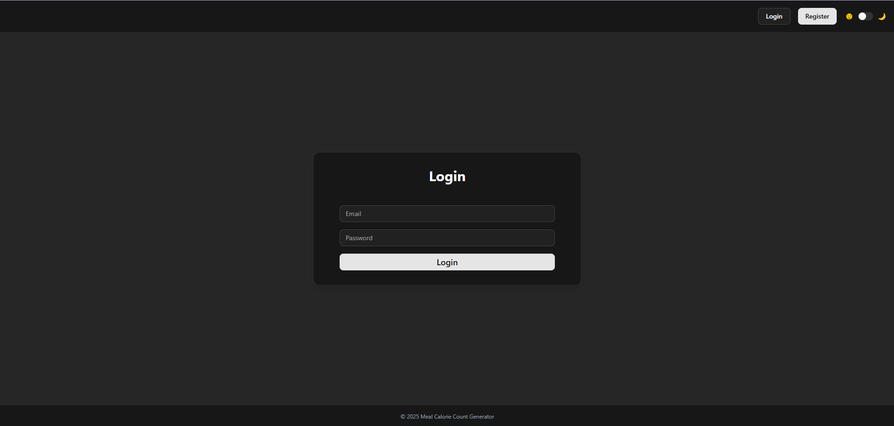
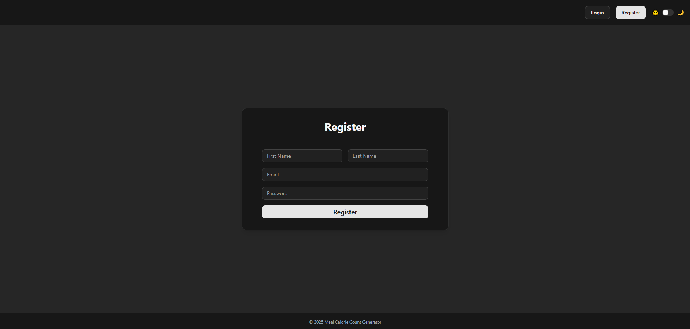
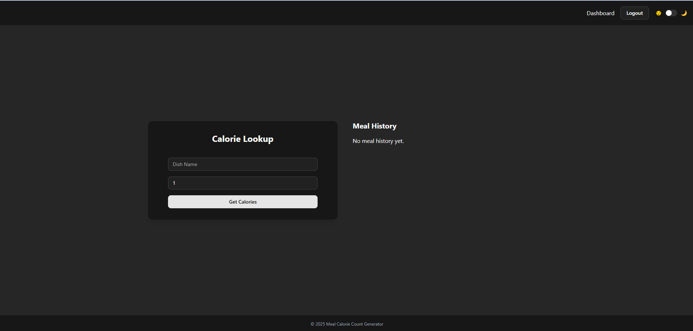
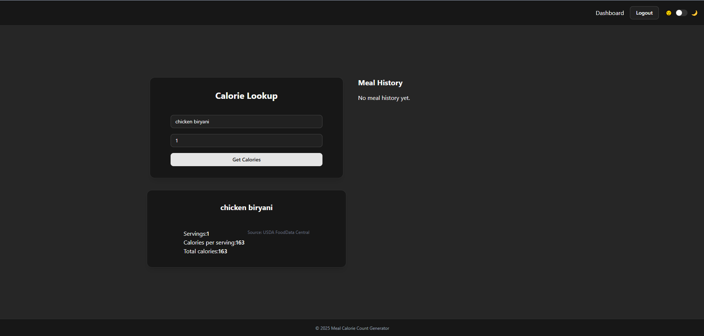
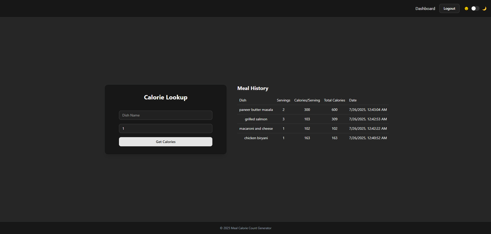

# Meal Calorie Count Generator – Frontend

A React/Next.js-based frontend for the Meal Calorie Count Generator. This interface allows users to register/login, calculate meal calories, and view their meal history. It communicates with a backend API that processes USDA FoodData Central data.

---

## **1. Setup Instructions**

### **Prerequisites**

* **Node.js** (v16 or later)
* **npm** or **yarn**

### **Steps**

1. **Clone the repository**

   ```bash
   git clone https://github.com/Wwebur/meal-calorie-frontend-rostyslav.git
   cd meal-calorie-frontend-rostyslav
   ```

2. **Install dependencies**

   ```bash
   npm install
   ```

3. **Create a `.env.local` file**
   Add environment variables:

   ```env
   NEXT_PUBLIC_API_BASE_URL=http://localhost:5000
   ```

4. **Run the development server**

   ```bash
   npm run dev
   ```

   The app will be available at `http://localhost:3000`.

---

## **2. Project Structure**

```
meal-calorie-frontend-rostyslav/
├── app/                    # Next.js App Router
│   ├── dashboard/         # Dashboard page
│   ├── login/            # Login page
│   ├── register/         # Register page
│   ├── layout.tsx        # Root layout
│   ├── page.tsx          # Home page
│   └── globals.css       # Global styles
├── components/           # React components
│   ├── ui/              # shadcn/ui components
│   ├── AuthForm.tsx     # Authentication form
│   ├── Header.tsx       # Navigation header
│   ├── Footer.tsx       # Footer component
│   ├── MealForm.tsx     # Meal input form
│   ├── ResultCard.tsx   # Calorie results display
│   ├── MealHistoryTable.tsx # Meal history table
│   └── ThemeToggle.tsx  # Dark/light mode toggle
├── lib/                 # Utility libraries
│   ├── api.ts          # API client functions
│   ├── cache.ts        # LRU caching system
│   ├── useAuthGuard.ts # Authentication guard hook
│   └── utils.ts        # Utility functions
├── stores/             # Zustand state management
│   ├── authStore.ts    # Authentication state
│   ├── mealStore.ts    # Meal calculation state
│   └── mealHistoryStore.ts # Meal history state
├── types/              # TypeScript type definitions
│   └── index.ts        # Global type definitions
└── images/             # Screenshots and assets
```

---

## **3. Key Components**

### **Core Components**
* **`AuthForm.tsx`** – Handles login and registration with validation via Zod
* **`MealForm.tsx`** – Accepts dish name and servings to calculate calories
* **`ResultCard.tsx`** – Displays calorie calculation results
* **`MealHistoryTable.tsx`** – Shows user meal history

### **Layout Components**
* **`Header.tsx`** – Responsive navigation header with mobile menu
* **`Footer.tsx`** – Footer component
* **`ThemeToggle.tsx`** – Dark/light mode toggle with emoji indicators

### **State Management**
* **`useAuthGuard.ts`** – Protects routes by checking authentication
* **Zustand Stores:** `authStore.ts`, `mealStore.ts`, and `mealHistoryStore.ts` manage app state

### **Utilities**
* **`api.ts`** – API client with error handling and request/response interceptors
* **`cache.ts`** – LRU caching system for calorie data with configurable TTL
* **`utils.ts`** – General utility functions

---

## **4. Technology Stack**

### **Frontend Framework**
* **Next.js 15.4.4** – React framework with App Router for SSR and static optimizations
* **React 19.1.0** – Latest React with concurrent features

### **UI & Styling**
* **shadcn/ui** – Modern component library built on Radix UI
* **Tailwind CSS 4** – Utility-first CSS framework
* **next-themes** – Theme switching with system preference detection

### **State Management & Validation**
* **Zustand** – Lightweight state management (selected over Redux for simplicity)
* **Zod** – TypeScript-first schema validation

### **HTTP Client**
* **Axios** – HTTP client with interceptors for API communication

### **Development Tools**
* **TypeScript** – Type-safe JavaScript
* **Turbopack** – Fast bundler for development

---

## **5. Features**

### **Authentication**
* User registration and login
* Protected routes with authentication guards
* Persistent session management

### **Meal Calculation**
* Real-time calorie calculation
* Support for multiple servings
* Cached results for improved performance

### **User Experience**
* Responsive design with mobile-first approach
* Dark/light mode toggle
* Mobile-friendly navigation with hamburger menu
* Loading states and error handling

### **Performance**
* LRU caching system for calorie data (30-minute TTL)
* Optimized API calls with request deduplication
* Static page generation where possible

---

## **6. Design & Trade-offs**

* **Next.js App Router** chosen for modern React patterns and improved performance
* **shadcn/ui** used for consistent, accessible, and customizable components
* **Zustand** selected over Redux for minimal boilerplate and simplicity
* **LRU Caching** implemented for better performance and reduced API calls
* **Mobile-first responsive design** for broad device compatibility
* **Trade-off:** Limited offline support – can add PWA features later

---

## **7. Screenshots**





